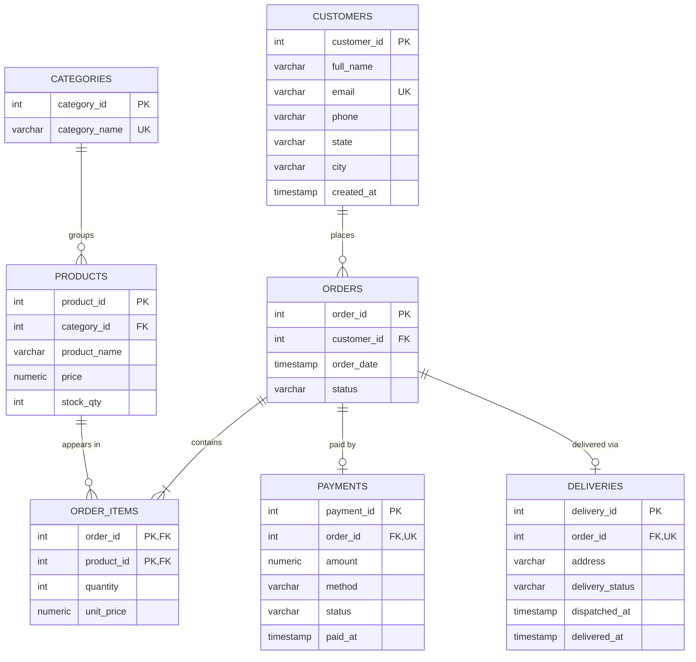

# NaijaMart ER Diagram

```mermaid
erDiagram
    CUSTOMERS ||--o{ ORDERS : places
    ORDERS ||--|{ ORDER_ITEMS : contains
    PRODUCTS ||--o{ ORDER_ITEMS : "appears in"
    CATEGORIES ||--o{ PRODUCTS : groups
    ORDERS ||--o| PAYMENTS : "paid by"
    ORDERS ||--o| DELIVERIES : "delivered via"

    CUSTOMERS {
        int customer_id PK
        varchar full_name
        varchar email UK
        varchar phone
        varchar state
        varchar city
        timestamp created_at
    }
    CATEGORIES {
        int category_id PK
        varchar category_name UK
    }
    PRODUCTS {
        int product_id PK
        int category_id FK
        varchar product_name
        numeric price
        int stock_qty
    }
    ORDERS {
        int order_id PK
        int customer_id FK
        timestamp order_date
        varchar status
    }
    ORDER_ITEMS {
        int order_id PK, FK
        int product_id PK, FK
        int quantity
        numeric unit_price
    }
    PAYMENTS {
        int payment_id PK
        int order_id FK, UK
        numeric amount
        varchar method
        varchar status
        timestamp paid_at
    }
    DELIVERIES {
        int delivery_id PK
        int order_id FK, UK
        varchar address
        varchar delivery_status
        timestamp dispatched_at
        timestamp delivered_at
    }
```
